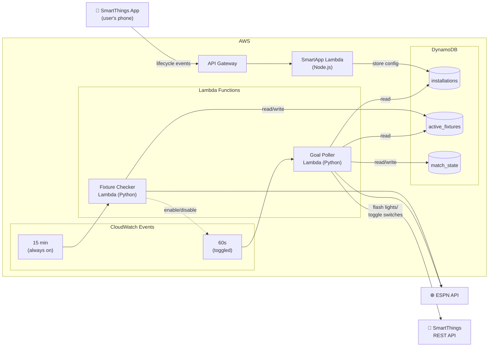

# ⚽ Goal Watcher — SmartThings Scottish Football Goal Alert

A Samsung SmartThings app that triggers home events (flash lights, toggle switches) when your favourite Scottish football team scores a goal. Powered by the [ESPN public API](https://github.com/pseudo-r/Public-ESPN-API).

## Architecture



### Two-Poller Design

- **Fixture Checker** (every 15 min, always on) — discovers upcoming/live matches for tracked teams and enables the Goal Poller rule when a match is live
- **Goal Poller** (every 60s, toggled) — only runs during live matches to detect score changes and trigger SmartThings devices
- This avoids constant polling when no games are on

## Competitions Covered

| Slug | Competition |
|------|-------------|
| `sco.1` | Scottish Premiership |
| `sco.2` | Scottish Championship |
| `sco.3` | Scottish League One |
| `sco.4` | Scottish League Two |
| `sco.tennents` | Scottish Cup |
| `sco.cis` | Scottish League Cup |
| `sco.challenge` | Scottish Challenge Cup |

## Prerequisites

- **Python 3.14+** with [uv](https://docs.astral.sh/uv/)
- **Node.js LTS** with npm
- **AWS CLI** configured with credentials
- **AWS CDK** (`npm install -g aws-cdk`)
- **Samsung SmartThings Developer Account** — [developer.smartthings.com](https://developer.smartthings.com/)

## Setup

### 1. Clone and install dependencies

```bash
git clone <repo-url>
cd goal_watcher

# Python dependencies
uv sync

# Node.js SmartApp dependencies
cd smartapp && npm install && cd ..
```

### 2. Register SmartApp in SmartThings Developer Workspace

1. Go to [developer.smartthings.com](https://developer.smartthings.com/) → **New Project** → **Automation for the SmartThings App**
2. Select **WebHook Endpoint** as the hosting type
3. After deploying (step 3 below), paste the API Gateway URL as the webhook endpoint
4. Under **App Display Name**, set a name like "Goal Watcher"
5. Under **Permissions**, add: `r:devices:*`, `x:devices:*`
6. Save and note the **App ID** and **Client ID/Secret**

### 3. Deploy to AWS

```bash
# Bootstrap CDK (first time only)
cdk bootstrap

# Deploy the stack
cdk deploy GoalWatcherStack
```

The deploy will output:
- `ApiEndpoint` — paste this into SmartThings Developer Workspace as the webhook URL
- Table names and Lambda function names

### 4. Install the SmartApp on your phone

1. Open the **SmartThings app** on your phone
2. Go to **Menu** → **SmartApps** → **+** → find your app
3. Select your Scottish football team
4. Choose lights/switches to trigger on goals
5. Select which competitions to monitor

## Development

```bash
# Python: run tests
uv run pytest

# Python: lint + format
uv run ruff check . && uv run ruff format .

# Python: type check
uv run mypy app/ tests/

# Node.js: run tests
cd smartapp && npm test

# Node.js: lint
cd smartapp && npm run lint

# CDK: validate stack
cdk synth
```

## Project Structure

```
app/
  app.py                              # CDK app entrypoint
  goal_watcher/
    cdk/                              # CDK stack definition
    fixture_checker/                  # Fixture discovery Lambda (Python)
    goal_poller/                      # Goal detection + notification Lambda (Python)
    model/                            # Pydantic models
    shared/                           # ESPN client, DynamoDB helpers, constants
smartapp/                             # Node.js SmartThings SmartApp Lambda
  src/
    index.js                          # Lambda handler
    smartapp.js                       # SmartApp config pages
    dynamodb-context-store.js         # DynamoDB context store adapter
    teams.js                          # 42 Scottish teams with ESPN IDs
tests/
  unit/                               # Unit tests (network disabled)
  integration/                        # Integration tests (network enabled)
```

## How It Works

1. **User installs SmartApp** → selects team (e.g., St Johnstone) + devices (lights, switches) + competitions → stored in DynamoDB
2. **Fixture Checker** runs every 15 minutes → polls ESPN for all Scottish competitions → finds matches involving the tracked team → stores active fixtures in DynamoDB → enables Goal Poller
3. **Goal Poller** runs every 60 seconds during live matches → compares current score vs stored state → detects new goals → fetches scorer details from ESPN match summary
4. **On goal detected** → reads SmartApp installations from DynamoDB → sends commands to SmartThings REST API → lights flash, switches toggle
5. **When match ends** → Fixture Checker disables the Goal Poller rule until the next match day

## ESPN API

This project uses the undocumented ESPN public API. Key endpoints:

- `site.api.espn.com/apis/site/v2/sports/soccer/{league}/scoreboard` — live scores
- `site.api.espn.com/apis/site/v2/sports/soccer/{league}/summary?event={id}` — match details with goals
- `site.api.espn.com/apis/site/v2/sports/soccer/{league}/teams` — team lists

No authentication required. See [pseudo-r/Public-ESPN-API](https://github.com/pseudo-r/Public-ESPN-API) for full documentation.

## License

MIT
